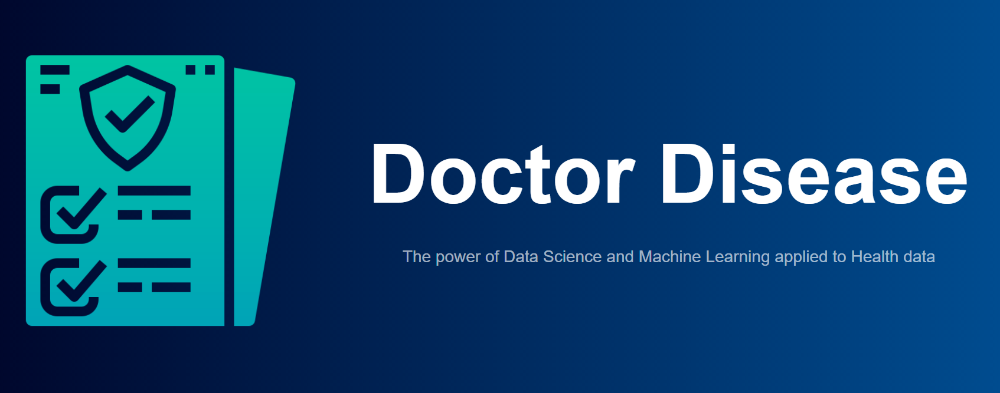

<p align="center">
  
</p>

# DS4A-Project
Repository of the final project of Team 24

# Identification of patients with a specific observable feature
- Natural language processing (NLP) code to extract relevant information of the medical notes. 
- Predictive model that gives us an accurate identification of patients with a specific observable feature (certain pathologies or health conditions) 

## Problem Description
Syphilis is a disease which can present a multitude of different symptoms, for which the main indicator (chancres) is only present during the onset of the condition, i.e. Primary syphilis. Each year, 5 million people are diagnosed with this affliction, and its diagnosis can be difficult and can depend on a multitude of factors such as the microbiologist’s experience when analyzing a patient’s sample to the quantity of treponema bacteria present in the lesion during the sampling process. 

Similarly, diabetes is an incurable disease affecting more than 400 million people worldwide, where 25% of the Colombians who are afflicted by it may go undiagnosed until it’s too late. Even though there is no cure for diabetes, it is still a disease which can be managed through the use of clinical treatments as well as diet and exercise, and for which the earlier a diagnosis is done, the better prognosis the patient will have.
Leveraging the use of medical notes taken by multiple examiners, combined with the different laboratory testing performed on a patient, could help raise a flag in order for another medical expert to give their informed second opinion to a prior diagnosis and prevent a further onset of these diseases.

More information about the problem can be found in the [Project Report](Project_Report_Team24.pdf).

## Motivation
Despite the use of diagnostic code related to each health care service, it has been detected that in clinical practice errors can be introduced in said coding. These errors can impact the results obtained in clinical research by having patients that do not correspond to the pathology under study, or on the contrary, failing to identify all relevant patients.

## Technologies Used
The frontend was developed using Javascript, specifically the React framework, with the backend built in Django. The Exploratory Data Analysis (EDA) was done with the help of Jupyter, Pandas, Matplotlib, Seaborn and Plotly. The Machine Learning (ML) pipeline training process was built using the previously mentioned libraries in addition to Scikit-learn, XGBoost, NLTK, Spacy, and imb-learn. The deep learning models use Tensorflow in conunction with the libraries used by the ML proccess.

## Features
- Automatic preprocessor, feature selection and estimator hyperparameter tuning with the possibility of easily adding more parameters or estimators.
- NLP preprocessing of the Electronic Health REcords to extract information from natural text.
- Automatically selects the best performing estimator using 5-fold cross-validation, using the F1-measure to rank the different models, and incorporates the best estimator into the prediction pipeline, to be used directly in any prediction task.
- Frontend with a responsive design in mind.
- REST API built on top of Django.
- Capabilities of getting predictions through the Frontend prediction form or from an API call.

## Installation
The Python version we used for development was Python 3.9.12 in Ubuntu 20.04.4 LTS, with the exact version of the Python libraries found in the [requirements_versioned](requirements_versioned.txt) text file. The [requirements file](requirements.txt) contains the unversioned libraries needed to run the scripts for the ML and Deep Learning training, as well as the Django server, in a different environment/system than the one used for the versioned script. The resulting pipeline_predictor file, ready to be used to predict results and return the respective prediction code (e.g. A510), is already stored in the repo, so there's no need to run the ML training process, only to start up the Django service for API calls and optionally the frontend. If model training is desired, the datasets (sociodemografico.csv, laboratorios.csv, and notas.csv) to train it need to be placed in the data directory inside of the scripts directory (the path should look like scripts/data/).

## How to use
### Frontend and backend deployment
#### Backend
To run the backend, it is necessary to run the following command in a terminal from the root directory of this repository:
```
python manage.py runserver
```

The server should now be  running, and should be accesible through localhost. It is possible to test the server's POST capability and the capacity to predict based on data passed by passing the parameters as a json file in the body of the request, with the data similar to what is shown in the [sample_example](scripts/utils/sample_example.json) JSON file. The following example shows how to do this:
```
import requests

params = {
    "Edad": "40",
    "Genero": "Mujer",
    "GrupoEtnico": "Mestizo",
    "AreaResidencial": "Zona Urbana",
    "EstadoCivil": "Separado",
    "TSangre": "NaN",
    "Nombre": ["902046", "Test de urologia"],
    "Fecha": ["22/02/2022 18:43", "24/02/2022 00:00"],
    "Valor": ["6", "20"],
    "Tipo": "Confirmado Repetido",
    "Plan": "- Paciente se remite para analisis de urologia...",
}
url = "http://localhost:8000/api/post"
response = requests.post(url, data=params)
response.json()
```
The server should respond with a JSON file containing the prediction with the ICD10 code and the name of the predicted diagnosis (e.g. 'E109 : Type I diabetes mellitus').

Additionally, there is an [API test](scripts/utils/API_test.ipynb) notebook that can help with testing the different APIs.

#### Frontend
Detailed instructions for launching the Frontend can be found in the [README](/frontend/README.md) file inside of the frontend directory.

### EDA and ML training Notebooks
The scripts and notebooks required to train the ML pipeline can be found inside the [scripts](scripts/) directory. Inside of this directory there is another [README](scripts/README.md) with extra information on how to use the scripts. This step is not necessary as there is already a trained pipeline_predictor located [here](scripts/model/prediction_pipeline.pickle). The backend should automatically load it and be available for predictions.
The [docker-compose](docker-compose.yml) file contains the code necessary to fire up a GPU and a CPU docker container, which can be attached to to run the ML and deep learning scripts, or the Django server.

## Acknowledgements
Many thanks to IQVia Solutions for sharing with us the data that allowed us to create this predictive model and Correlation One for teaching us the tools that made it possible  

## Contributing
Pull requests are welcome. For major changes, please open an issue first to discuss what you would like to change.

Please make sure to update tests as appropriate.

## License
